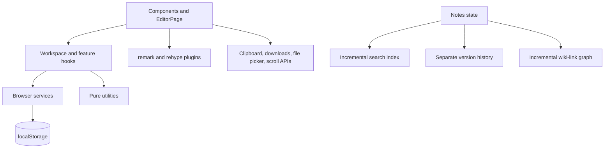

# MarkItDown

**A private, local-first Markdown workspace for notes that stay connected.**

Write beside a live preview, organize by tags, search across your library, follow wiki links, and restore earlier drafts. Everything is stored in your browser; there is no account or backend.

**Live demo:** `https://your-github-username.github.io/MarkItDown/` (replace with the deployed URL).

## Screenshots

Capture and add these files after a production build:

- `docs/screenshots/desktop-workspace.png`
- `docs/screenshots/mobile-workspace.png`
- `docs/screenshots/history-diff.png`
- `docs/screenshots/markdown-math-mermaid.png`

## Features

**Phase 1 · Multi-note library:** local note CRUD, import/export, migration, mobile sidebar, and saved/unsaved state.

**Phase 2 · Tags and search:** manual and inline tags, nested filters, an incremental full-text index, prefix/ranked search, and the keyboard search palette.

**Phase 3 · Knowledge workspace:** version history with diff/restore/undo, table of contents, `[[wiki links]]`, backlinks, unlinked mentions, and atomic rename rewrites.

**Phase 4 · Polish and ship:** KaTeX and Mermaid, smart textarea editing, proportional scroll sync, ZIP/JSON backup, conflict-aware imports, PWA assets, and automated CI/E2E coverage.

## Architecture



Notes are updated in the workspace hook and persisted under `markitdown-notes`. Search and the link graph reconcile note changes incrementally. History is stored separately under `markitdown-history`; imports snapshot replacements before committing. Markdown parsing and diff/front-matter logic remain in pure utilities and plugins.

## Tech Stack

| Area | Technology |
| --- | --- |
| UI | React 19, TypeScript, CSS tokens |
| Build and PWA | Vite, vite-plugin-pwa, Workbox |
| Markdown | react-markdown, remark-gfm, remark-math, rehype-highlight, rehype-katex |
| Diagrams and archives | Lazy Mermaid, lazy fflate ZIP support |
| Tests | Vitest, Playwright Chromium, axe-core |
| Icons | lucide-react |

Mermaid, KaTeX, and fflate are dynamically imported. Mermaid SVG is rendered through an encoded image URL, not HTML injection. KaTeX CSS loads only when a math expression is detected. Workbox precaches the app shell and caches lazy assets on first use.

See [docs/BUNDLE_REPORT.md](docs/BUNDLE_REPORT.md) for measured entry and lazy-chunk sizes and the bundle inspection command.

## Setup and Checks

Requirements: Node.js 22+ and npm.

```bash
npm ci
npm run dev
npm run lint
npm run typecheck
npm run test
npm run test:e2e
npm run check
```

`test:e2e` creates a production build, serves it with `vite preview`, and runs Chromium tests. Install the browser once with `npx playwright install chromium`. `npm run icons` regenerates the checked-in PNG app icons using only Node built-ins.

## Keyboard Shortcuts

| Shortcut | Action |
| --- | --- |
| `Ctrl/Cmd + B` | Bold |
| `Ctrl/Cmd + I` | Italic |
| `Ctrl/Cmd + K` | Search; inserts a link when text is selected in the editor |
| `Ctrl/Cmd + S` | Save/download the active note |
| `Ctrl + Alt + N` | New note |
| `Ctrl + Alt + H` | Version history |
| `?` | Keyboard shortcut reference |
| `Enter` in a list | Continue the current marker |
| `Tab` / `Shift + Tab` | Indent/outdent list lines; otherwise move focus |
| `/` after whitespace | Open block-command menu |
| `[[` | Open note-link suggestions |

## Data and Privacy

| Record | Fields |
| --- | --- |
| Note | `id`, `title`, `content`, `savedContent`, `tags`, `createdAt`, `updatedAt` |
| Note version | `id`, `noteId`, `content`, `title`, `createdAt`, `reason`, optional `label` |
| History payload | `{ version: 1, byNote: Record<noteId, NoteVersion[]> }` |

| Storage key | Contents |
| --- | --- |
| `markitdown-notes` | Versioned note library; existing schema remains compatible |
| `markitdown-history` | Independently versioned note snapshots |
| `markitdown-theme` | Light, dark, or system theme |
| `markitdown-sidebar` | Sidebar collapse preference |
| `markitdown-toc` | TOC collapsed preference |
| `markitdown-scrollsync` | Proportional scroll-sync toggle |
| `markitdown-autopair` | Auto-pair toggle |

Notes, tags, preferences, and history stay in the current browser profile. No content is sent to a server. Browser storage is quota-limited; backups are the recommended way to move or safeguard a library. ZIP import is capped at 100 MB compressed and 50 MB expanded, rejects unsafe paths and invalid UTF-8, and warns above 20 MB.

## Design Decisions and Trade-offs

- A small custom inverted index avoids a runtime search dependency and supports incremental updates, prefix matching, and field-weighted ranking.
- A textarea keeps the editor lightweight and preserves native browser undo for smart edits where `execCommand('insertText')` is available. The fallback uses `setRangeText` and a bubbling input event.
- The textarea line-number gutter tracks logical lines; wrapped visual lines are not separately numbered.
- LocalStorage keeps the app backend-free and offline-friendly but is not an unlimited database. History is capped and pruned, and ZIP/JSON backups provide portability.
- Mermaid supports its package’s diagram grammars, so its first-use download is comparatively large. Those assets are kept out of PWA precache and cached after use.
- Wiki links resolve by normalized title; duplicate titles select the most recently updated note and disclose the ambiguity.

## Deployment

GitHub Pages builds with `base: '/MarkItDown/'` when `GITHUB_ACTIONS=true`; set `VITE_BASE_PATH` to override it. The PWA manifest derives `start_url` and `scope` from the same base. A Pages workflow is in `.github/workflows/deploy.yml`. Netlify and Vercel can use the root base `/` and publish `dist/`.

## Lighthouse Checklist

Target scores: Performance ≥ 90, Accessibility ≥ 95, Best Practices ≥ 95, PWA ≥ 90. Test desktop and mobile production builds; verify offline shell startup, then first-use math/Mermaid caching, keyboard focus, color contrast, manifest icons, and installability. Record the audited URL and Lighthouse version with each release.

## Known Limitations and Roadmap

Line numbers follow logical textarea lines rather than wrapped display rows. ZIP import accepts MarkItDown’s own manifest/front matter format. Search filters do not yet query graph relationships. Future work: optional IndexedDB storage for very large libraries, heading-aware scroll synchronization, and graph-aware search.

## License

MIT